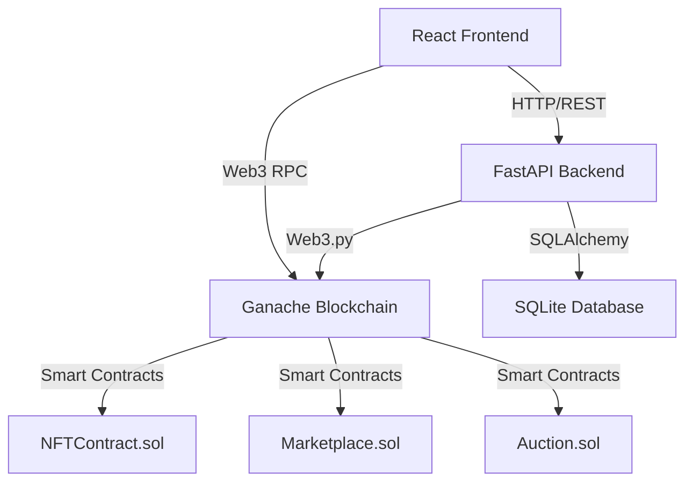

# NFT Marketplace - Complete Technical Documentation

## Table of Contents
1. [Project Overview](#project-overview)
2. [Architecture](#architecture)
3. [Smart Contracts](#smart-contracts)
4. [Backend Implementation](#backend-implementation)
5. [Frontend Implementation](#frontend-implementation)
6. [Blockchain Integration](#blockchain-integration)
7. [Database Schema](#database-schema)
8. [API Endpoints](#api-endpoints)
9. [Key Features](#key-features)

---

## Project Overview

This is a full-stack decentralized NFT marketplace built with:
- **Smart Contracts**: Solidity (ERC721, ERC2981)
- **Blockchain**: Ethereum (Ganache for local development)
- **Backend**: Python FastAPI
- **Frontend**: React + Vite
- **Database**: SQLite
- **Web3 Integration**: Web3.py (backend), ethers.js (frontend)

The marketplace supports NFT minting, buying/selling, auctions, collections, and royalty payments.

---

## Architecture

### High-Level Architecture



### Component Interaction Flow

1. **User Action** → Frontend React Component
2. **Frontend** → Backend API (metadata, user data)
3. **Frontend** → Blockchain (direct transactions via MetaMask/private key)
4. **Backend** → Blockchain (transaction signing, contract interaction)
5. **Backend** → Database (indexing, caching, user profiles)
6. **Blockchain** → Smart Contracts (state changes, events)
7. **Backend Indexer** → Monitors blockchain events → Updates database

---

## Smart Contracts

### 1. NFTContract.sol

**Purpose**: ERC721 NFT token with royalty support (ERC2981)

**Key Features**:
- Minting NFTs with metadata URI
- Royalty configuration per token
- Token enumeration
- Creator tracking
- Burn functionality

**Main Functions**:
```solidity
function mintNFT(
    address to,
    string memory uri,
    address royaltyReceiver,
    uint96 royaltyFeeNumerator
) public returns (uint256)

function burn(uint256 tokenId) public

function setTokenRoyalty(
    uint256 tokenId,
    address receiver,
    uint96 feeNumerator
) public

function getCreator(uint256 tokenId) public view returns (address)
```

**Inheritance**:
- `ERC721` - Base NFT standard
- `ERC721URIStorage` - Metadata URI storage
- `ERC721Enumerable` - Token enumeration
- `ERC2981` - Royalty standard
- `Ownable` - Access control

**Events**:
- `NFTMinted(tokenId, creator, tokenURI)`
- `NFTBurned(tokenId, owner)`
- `RoyaltySet(tokenId, receiver, feeNumerator)`

---

### 2. Marketplace.sol

**Purpose**: NFT marketplace for buying/selling with platform fees

**Key Features**:
- List NFTs for sale
- Buy NFTs with ETH
- Platform fee collection (2.5% default)
- Royalty payment support
- Cancel listings

**Main Functions**:
```solidity
function listNFT(
    address nftContract,
    uint256 tokenId,
    uint256 price
) external returns (uint256)

function buyNFT(uint256 listingId) external payable nonReentrant

function cancelListing(uint256 listingId) external

function updateListing(uint256 listingId, uint256 newPrice) external

function setPlatformFee(uint256 newFee) external onlyOwner
```

**Data Structures**:
```solidity
struct Listing {
    address seller;
    address nftContract;
    uint256 tokenId;
    uint256 price;
    bool active;
}
```

**Events**:
- `NFTListed(listingId, seller, nftContract, tokenId, price)`
- `NFTSold(listingId, buyer, seller, nftContract, tokenId, price)`
- `ListingCancelled(listingId)`
- `ListingUpdated(listingId, newPrice)`

**Fee Distribution**:
1. Platform fee (2.5%)
2. Royalty fee (if applicable, up to 10%)
3. Remaining amount to seller

---

### 3. Auction.sol

**Purpose**: Time-based auction system for NFTs

**Key Features**:
- Create auctions with start/end times
- Place bids with automatic refunds
- Reserve price enforcement
- Automatic winner determination
- NFT transfer on auction end

**Main Functions**:
```solidity
function createAuction(
    address nftContract,
    uint256 tokenId,
    uint256 startTime,
    uint256 endTime,
    uint256 reservePrice
) external nonReentrant returns (uint256)

function placeBid(uint256 auctionId) external payable nonReentrant

function endAuction(uint256 auctionId) external

function cancelAuction(uint256 auctionId) external
```

**Data Structures**:
```solidity
struct Auction {
    address seller;
    address nftContract;
    uint256 tokenId;
    uint256 startTime;
    uint256 endTime;
    uint256 reservePrice;
    address highestBidder;
    uint256 highestBid;
    bool ended;
}
```

**Events**:
- `AuctionCreated(auctionId, seller, nftContract, tokenId, startTime, endTime, reservePrice)`
- `BidPlaced(auctionId, bidder, amount)`
- `AuctionEnded(auctionId, winner, amount)`
- `AuctionCancelled(auctionId)`

**Timing Validation**:
- Start time must be >= current block timestamp
- End time must be > start time
- Bids only accepted during auction period

---

## Backend Implementation

### Directory Structure

```
backend/
├── app/
│   ├── __init__.py
│   ├── main.py              # FastAPI application entry
│   ├── config.py            # Configuration settings
│   ├── database.py          # Database connection
│   ├── models/              # SQLAlchemy models
│   │   ├── models.py        # User, NFT, Listing, Auction, Collection
│   ├── routers/             # API route handlers
│   │   ├── nft.py           # NFT endpoints
│   │   ├── marketplace.py   # Marketplace endpoints
│   │   ├── auction.py       # Auction endpoints
│   │   ├── user.py          # User profile endpoints
│   │   ├── collection.py    # Collection endpoints
│   ├── schemas/             # Pydantic validation schemas
│   │   ├── nft.py
│   │   ├── marketplace.py
│   │   ├── auction.py
│   │   ├── user.py
│   │   ├── collection.py
│   ├── services/            # Business logic
│   │   ├── web3_service.py  # Web3 connection & contract loading
│   │   ├── nft_service.py   # NFT operations
│   │   ├── marketplace_service.py
│   │   ├── auction_service.py
│   │   ├── indexer_service.py  # Blockchain event indexing
```

### Core Services

#### 1. Web3Service (`services/web3_service.py`)

**Purpose**: Manage Web3 connection and contract instances

```python
class Web3Service:
    def __init__(self):
        self.w3 = Web3(Web3.HTTPProvider(settings.BLOCKCHAIN_RPC_URL))
        self.nft_contract = self.load_contract('NFTContract')
        self.marketplace_contract = self.load_contract('Marketplace')
        self.auction_contract = self.load_contract('Auction')
    
    def load_contract(self, contract_name):
        # Load ABI and create contract instance
    
    def send_transaction(self, transaction, private_key):
        # Sign and send transaction
```

**Key Responsibilities**:
- Maintain Web3 connection to Ganache
- Load contract ABIs from build artifacts
- Provide contract instances to other services
- Sign and send transactions
- Estimate gas for transactions

---

#### 2. NFTService (`services/nft_service.py`)

**Purpose**: Handle NFT minting and metadata operations

```python
class NFTService:
    def mint_nft(
        self,
        to_address: str,
        token_uri: str,
        royalty_receiver: str,
        royalty_percentage: float,
        from_address: str,
        private_key: str
    ) -> Dict[str, Any]
```

**Operations**:
- Mint NFTs on blockchain
- Store NFT metadata in database
- Upload files to IPFS (via Pinata)
- Track NFT ownership
- Handle royalty configuration

---

#### 3. MarketplaceService (`services/marketplace_service.py`)

**Purpose**: Manage marketplace listings and sales

```python
class MarketplaceService:
    def create_listing(...)
    def buy_nft(...)
    def cancel_listing(...)
    def get_active_listings(...)
```

**Operations**:
- Create marketplace listings
- Process NFT purchases
- Calculate fees (platform + royalty)
- Update listing status
- Handle ETH transfers

---

#### 4. AuctionService (`services/auction_service.py`)

**Purpose**: Manage auction lifecycle

```python
class AuctionService:
    def create_auction(...)
    def place_bid(...)
    def end_auction(...)
    def get_auction_details(...)
```

**Operations**:
- Create time-based auctions
- Validate auction timing
- Process bids with automatic refunds
- End auctions and transfer NFTs
- Handle reserve prices

**Timing Logic**:
- Fetches current blockchain time
- Adds 120-second buffer to start_time
- Validates start_time >= block.timestamp
- Adjusts times if approval transaction mines blocks

---

#### 5. IndexerService (`services/indexer_service.py`)

**Purpose**: Monitor blockchain events and update database

```python
class IndexerService:
    async def start_indexing(self):
        # Monitor NFTMinted, NFTListed, NFTSold, AuctionCreated events
    
    async def index_nft_events(self):
        # Process NFT minting events
    
    async def index_marketplace_events(self):
        # Process listing and sale events
```

**Operations**:
- Listen for blockchain events
- Update database with on-chain data
- Sync NFT ownership
- Track transaction history
- Run as background task

---

### Database Models

#### User Model
```python
class User(Base):
    wallet_address: str (PK)
    username: str
    bio: str
    profile_image: str
    banner_image: str
    created_at: datetime
    
    # Relationships
    nfts: List[NFT]
    collections: List[Collection]
```

#### NFT Model
```python
class NFT(Base):
    token_id: int (PK)
    contract_address: str
    owner_address: str (FK)
    creator_address: str
    name: str
    description: str
    image_url: str
    token_uri: str
    category: str
    royalty_percentage: float
    is_listed: bool
    price_eth: float
    created_at: datetime
    
    # Relationships
    owner: User
    listings: List[Listing]
    auctions: List[Auction]
    collections: List[CollectionNFT]
```

#### Listing Model
```python
class Listing(Base):
    listing_id: int (PK)
    nft_id: int (FK)
    seller_address: str
    price_eth: float
    active: bool
    created_at: datetime
    sold_at: datetime
    buyer_address: str
```

#### Auction Model
```python
class Auction(Base):
    auction_id: int (PK)
    nft_id: int (FK)
    seller_address: str
    start_time: int
    end_time: int
    reserve_price_eth: float
    highest_bidder: str
    highest_bid_eth: float
    ended: bool
    created_at: datetime
```

#### Collection Model
```python
class Collection(Base):
    id: int (PK)
    owner_address: str (FK)
    name: str
    description: str
    category: str
    banner_image: str
    created_at: datetime
    updated_at: datetime
    
    # Relationships
    nfts: List[CollectionNFT]
```

#### CollectionNFT Model (Association Table)
```python
class CollectionNFT(Base):
    id: int (PK)
    collection_id: int (FK)
    nft_id: int (FK)
    added_at: datetime
```

---

## Frontend Implementation

### Directory Structure

```
frontend/src/
├── main.jsx                 # App entry point
├── App.jsx                  # Main app component with routing
├── index.css                # Global styles
├── components/              # Reusable components
│   ├── UI/                  # Base UI components
│   │   ├── Button.jsx
│   │   ├── Card.jsx
│   │   ├── DisplayName.jsx
│   │   ├── Navbar.jsx
│   ├── NFT/                 # NFT-specific components
│   │   ├── NFTCard.jsx
│   │   ├── MyNFTCard.jsx
│   │   ├── MintNFTModal.jsx
│   ├── Auction/             # Auction components
│   │   ├── AuctionCard.jsx
│   │   ├── CreateAuctionModal.jsx
│   │   ├── PlaceBidModal.jsx
│   ├── Collection/          # Collection components
│   │   ├── CollectionCard.jsx
│   │   ├── CreateCollectionModal.jsx
├── pages/                   # Page components
│   ├── Home.jsx
│   ├── Marketplace.jsx
│   ├── CreateNFT.jsx
│   ├── MyNFTs.jsx
│   ├── NFTDetail.jsx
│   ├── Auctions.jsx
│   ├── CollectionDetail.jsx
│   ├── Profile.jsx
├── context/                 # React context
│   ├── WalletContext.jsx    # Wallet connection state
```

### Key Components

#### 1. WalletContext

**Purpose**: Manage wallet connection state globally

```javascript
export const WalletProvider = ({ children }) => {
    const [account, setAccount] = useState(null);
    const [provider, setProvider] = useState(null);
    
    const connectWallet = async () => {
        // Connect to MetaMask
        const provider = new ethers.BrowserProvider(window.ethereum);
        const signer = await provider.getSigner();
        const address = await signer.getAddress();
        setAccount(address);
    };
    
    return (
        <WalletContext.Provider value={{ account, connectWallet }}>
            {children}
        </WalletContext.Provider>
    );
};
```

---

#### 2. NFT Components

**MyNFTCard.jsx**: Displays user's owned NFTs with media preview support

**Features**:
- Fetches metadata from IPFS
- Supports multiple media types:
  - Images (JPG, PNG, GIF)
  - Videos (MP4, WEBM) - 5s preview limit
  - Audio (MP3, WAV) - 10s preview limit
  - 3D Models (GLB, GLTF) - Interactive viewer
- Automatic retry with gateway rotation (5 IPFS gateways)
- Loading states and error handling

**Media Rendering Logic**:
```javascript
const renderMedia = () => {
    const url = imageUrl.toLowerCase();
    
    if (url.endsWith('.glb') || url.endsWith('.gltf')) {
        return <model-viewer src={imageUrl} auto-rotate camera-controls />;
    } else if (url.endsWith('.mp4') || url.endsWith('.webm')) {
        return <video src={imageUrl} controls muted loop onTimeUpdate={limitTo5s} />;
    } else if (url.endsWith('.mp3') || url.endsWith('.wav')) {
        return <audio src={imageUrl} controls onTimeUpdate={limitTo10s} />;
    } else {
        return ;
    }
};
```

**Gateway Rotation**:
```javascript
const IPFS_GATEWAYS = [
    'https://ipfs.io/ipfs/',
    'https://gateway.pinata.cloud/ipfs/',
    'https://cloudflare-ipfs.com/ipfs/',
    'https://dweb.link/ipfs/',
    'https://nftstorage.link/ipfs/'
];

// Rotate gateways on retry
const gatewayIndex = retryCount % IPFS_GATEWAYS.length;
const currentGateway = IPFS_GATEWAYS[gatewayIndex];
```

---

#### 3. Marketplace Components

**Marketplace.jsx**: Browse and purchase listed NFTs

**Features**:
- Grid display of active listings
- Filter by category
- Search functionality
- Direct purchase with MetaMask
- Price display in ETH

---

#### 4. Auction Components

**CreateAuctionModal.jsx**: Create new auctions

**Features**:
- Duration selection (1 hour to 2 weeks)
- Reserve price input
- Private key signing
- Blockchain time synchronization
- 60-second buffer for start_time

**Timing Logic**:
```javascript
// Fetch blockchain time
const timeResponse = await fetch('/api/v1/auction/blockchain-time');
const { timestamp: blockchainTime } = await timeResponse.json();

// Add 60-second buffer
const startTime = blockchainTime + 60;
const endTime = startTime + parseInt(duration);
```

**PlaceBidModal.jsx**: Place bids on active auctions

**Features**:
- Minimum bid validation
- Automatic refund of previous bid
- Real-time bid updates
- Countdown timer

---

#### 5. Collection Components

**CollectionDetail.jsx**: Manage NFT collections

**Features**:
- Display collection metadata
- Grid of NFTs in collection
- Add/remove NFTs (owner only)
- Collection editing

---

### Routing

```javascript
<Routes>
    <Route path="/" element={<Home />} />
    <Route path="/marketplace" element={<Marketplace />} />
    <Route path="/create" element={<CreateNFT account={account} />} />
    <Route path="/my-nfts" element={<MyNFTs account={account} />} />
    <Route path="/nft/:tokenId" element={<NFTDetail account={account} />} />
    <Route path="/auctions" element={<Auctions account={account} />} />
    <Route path="/collection/:collectionId" element={<CollectionDetail account={account} />} />
    <Route path="/profile/:address" element={<Profile />} />
</Routes>
```

---

## Blockchain Integration

### Web3 Connection Flow

#### Frontend (ethers.js)
```javascript
// Connect to MetaMask
const provider = new ethers.BrowserProvider(window.ethereum);
const signer = await provider.getSigner();
const address = await signer.getAddress();

// Load contract
const contract = new ethers.Contract(
    contractAddress,
    contractABI,
    signer
);

// Send transaction
const tx = await contract.mintNFT(to, uri, royaltyReceiver, royaltyFee);
await tx.wait();
```

#### Backend (web3.py)
```python
# Connect to Ganache
w3 = Web3(Web3.HTTPProvider('http://127.0.0.1:7545'))

# Load contract
contract = w3.eth.contract(
    address=contract_address,
    abi=contract_abi
)

# Build transaction
transaction = contract.functions.mintNFT(...).build_transaction({
    'from': from_address,
    'nonce': w3.eth.get_transaction_count(from_address),
    'gas': 2000000,
    'gasPrice': w3.eth.gas_price
})

# Sign and send
signed_txn = w3.eth.account.sign_transaction(transaction, private_key)
tx_hash = w3.eth.send_raw_transaction(signed_txn.rawTransaction)
```

### Event Monitoring

**Indexer Service** monitors blockchain events:

```python
# Get events from blockchain
nft_filter = nft_contract.events.NFTMinted.create_filter(fromBlock='latest')
events = nft_filter.get_all_entries()

for event in events:
    token_id = event['args']['tokenId']
    creator = event['args']['creator']
    token_uri = event['args']['tokenURI']
    
    # Update database
    db_nft = NFT(
        token_id=token_id,
        creator_address=creator,
        token_uri=token_uri,
        ...
    )
    db.add(db_nft)
    db.commit()
```

---

## API Endpoints

### NFT Endpoints (`/api/v1/nft`)

| Method | Endpoint | Description |
|--------|----------|-------------|
| POST | `/mint` | Mint new NFT |
| GET | `/user/{address}` | Get user's NFTs |
| GET | `/{token_id}` | Get NFT details |
| DELETE | `/{token_id}` | Burn NFT |
| GET | `/all` | Get all NFTs |

### Marketplace Endpoints (`/api/v1/marketplace`)

| Method | Endpoint | Description |
|--------|----------|-------------|
| POST | `/list` | List NFT for sale |
| POST | `/buy/{listing_id}` | Buy NFT |
| DELETE | `/cancel/{listing_id}` | Cancel listing |
| GET | `/listings` | Get active listings |
| GET | `/user/{address}/sales` | Get user's sales history |

### Auction Endpoints (`/api/v1/auction`)

| Method | Endpoint | Description |
|--------|----------|-------------|
| POST | `/create` | Create auction |
| POST | `/bid` | Place bid |
| POST | `/end/{auction_id}` | End auction |
| GET | `/active` | Get active auctions |
| GET | `/{auction_id}` | Get auction details |
| GET | `/blockchain-time` | Get current blockchain timestamp |

### Collection Endpoints (`/api/v1/collection`)

| Method | Endpoint | Description |
|--------|----------|-------------|
| POST | `/create` | Create collection |
| GET | `/{collection_id}` | Get collection details |
| GET | `/user/{address}` | Get user's collections |
| PUT | `/{collection_id}` | Update collection |
| DELETE | `/{collection_id}` | Delete collection |
| POST | `/{collection_id}/add-nft` | Add NFT to collection |
| DELETE | `/{collection_id}/remove-nft/{nft_id}` | Remove NFT from collection |

### User Endpoints (`/api/v1/users`)

| Method | Endpoint | Description |
|--------|----------|-------------|
| GET | `/{address}/profile` | Get user profile |
| PUT | `/{address}/profile` | Update profile |
| POST | `/{address}/profile` | Create profile |

---

## Key Features

### 1. NFT Minting
- Upload media to IPFS
- Create metadata JSON
- Mint on blockchain with royalties
- Store in database for indexing

### 2. Marketplace
- List NFTs with custom prices
- Buy with ETH
- Platform fee (2.5%)
- Automatic royalty distribution

### 3. Auctions
- Time-based bidding
- Reserve prices
- Automatic refunds
- Winner determination

### 4. Collections
- Organize NFTs into groups
- Custom metadata (name, description, banner)
- Add/remove NFTs
- Public viewing

### 5. Media Support
- Images (JPG, PNG, GIF, SVG)
- Videos (MP4, WEBM, OGG) - 5s preview
- Audio (MP3, WAV) - 10s preview
- 3D Models (GLB, GLTF) - Interactive viewer

### 6. IPFS Integration
- Pinata for file storage
- Multiple gateway fallback
- Automatic retry on failure
- Cache busting for retries

### 7. User Profiles
- Wallet-based authentication
- Custom username and bio
- Profile and banner images
- NFT ownership tracking

---

## Deployment Configuration

### Environment Variables (.env)

```bash
# Blockchain
BLOCKCHAIN_RPC_URL=http://127.0.0.1:7545
CHAIN_ID=1337

# Contracts (from truffle migration)
NFT_CONTRACT_ADDRESS=0x...
MARKETPLACE_CONTRACT_ADDRESS=0x...
AUCTION_CONTRACT_ADDRESS=0x...

# Database
DATABASE_URL=sqlite:///./nft_marketplace.db

# Security
SECRET_KEY=your-secret-key-here

# IPFS
PINATA_JWT=your-pinata-jwt
PINATA_GATEWAY=https://gateway.pinata.cloud/ipfs/

# CORS
ALLOWED_ORIGINS=http://localhost:3000,http://localhost:5173
```

### Running the Application

1. **Start Ganache**: Launch Ganache GUI on port 7545
2. **Deploy Contracts**: `truffle migrate --reset`
3. **Start Backend**: `cd backend && uvicorn app.main:app --reload`
4. **Start Frontend**: `cd frontend && npm run dev`
5. **Access**: http://localhost:5173

---

## Technical Highlights

### 1. Auction Timing Solution
- Fetches blockchain time before creating auction
- Adds 120-second buffer to account for mining delays
- Validates timing after approval transactions
- Prevents "Start time must be in future" errors

### 2. Media Preview System
- Detects file type from URL extension
- Renders appropriate HTML5 element
- Implements preview duration limits
- Uses Google Model Viewer for 3D models

### 3. Gateway Rotation
- Maintains list of 5 IPFS gateways
- Rotates on each retry attempt
- Handles CORS and availability issues
- Ensures media eventually loads

### 4. Event Indexing
- Background service monitors blockchain
- Syncs on-chain data to database
- Provides fast queries for frontend
- Maintains data consistency

### 5. Security
- Private key handling via secure modals
- Ownership validation on all operations
- Reentrancy guards on contracts
- Input validation on all endpoints

---

## Future Enhancements

1. **Layer 2 Integration**: Deploy to Polygon/Arbitrum for lower fees
2. **IPFS Pinning**: Automatic pinning of uploaded content
3. **Lazy Minting**: Mint on first purchase to save gas
4. **Batch Operations**: Mint/list multiple NFTs at once
5. **Advanced Search**: Full-text search, filters, sorting
6. **Notifications**: Email/push notifications for bids, sales
7. **Analytics**: Dashboard with sales metrics, trends
8. **Social Features**: Comments, likes, follows
9. **Mobile App**: React Native mobile application
10. **Multi-chain**: Support for multiple blockchains

---

*Last Updated: December 2, 2025*
